# Smart Trunk Opener
____________________________

## 1. Introduction
Smart Trunk Opener using Time Series Artificial Intelligence 

  

The project was implemented using the GRU (Gated Recurrent Unit) Neural Network.

Used 24 GHz MMIC low power multi-channel radar for intelligent detection.

The model receives the processed data that is obtained from the radar and returns Kick or No Kick for time interval.

This is an illustration of how our model makes a prediction. When the full kick is inside the 50-sized window,
we get a positive result, otherwise, the result is negative.

  

______________________________
______________________________

## 2. Result

These are the results of tests on benchmarking data:
<table style="width:100%">
  <tr>
    <th></th>
    <th>Metrics</th>
  </tr>
  <tr>
    <th>ACC</th>
    <th>99.82%</th>
  </tr>
  </tr>
    <th>Kick ACC</th>
    <th>98.83%</th>
  </tr>
  <tr>
    <th>No kick ACC</th>
    <th>99.89%</th>
  </tr>
  <tr>
    <th>Precision</th>
    <th>98.38%</th>
  </tr>
  <tr>
    <th>Recall</th>
    <th>98.83%</th>
  </tr>
</table>

_______________________________
_______________________________

## 3. Data description

The dataset is collected manually, using the technique shown in the gif below. During the process of a kick motion, a person presses a keyboard key to label the pressed time frames as 1 (kick). Thus, each 40ms-long frame gets either a label of 1 or 0.
The raw data is a time series data (spectrogram). The shape of the data is (Nx2x2x32), where:

    1) N - the number of 40ms-long frames in the data,
    2) 2 - the 2 antennas of the radar, that were used,
    3) 2 - the I, Q complex components of the wave, corresponding to the given frame,
    4) 32 - the number of samples for the digital representation of an analog (continuous) wave,
             corresponding to a frame.

&emsp;&emsp;&emsp;&emsp;&emsp;&emsp;&emsp;&emsp;&emsp;&emsp;&emsp;&emsp;&nbsp;&nbsp;&nbsp;&nbsp;Collect Data&emsp;&emsp;&nbsp;&nbsp;&nbsp;&nbsp;&nbsp;&emsp;&emsp;&emsp;&nbsp;&emsp;&emsp;&emsp;&emsp;&emsp;&emsp;&emsp;&emsp;&emsp;&emsp;&emsp;Original Data

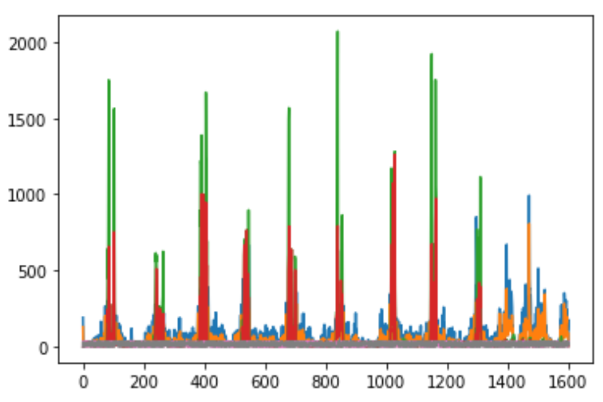

Labeling Data

The data is represented as a complex number, taking the I and Q components, that is, the real and imaginary parts. Afterwards, the shape of the data becomes (Nx2x32).
The data is preprocessed with a custom Fast Fourier Transform (FFT) algorithm. FFT computes the discrete Fourier Transformation and its inverse. It is used to convert a digital signal from the time domain into a signal in the frequency domain. Later, the amplitudes of the resulting transformation get calculated and the relation of every frequency bin to a corresponding amplitude is obtained. To get Target data from the FFT data, the 2 strongest amplitudes and corresponding frequencies get selected, and the shape of the data becomes (Nx2x2x2) (frames, antennas, number of targets, amplitudes/bins). Bit shifts are performed on the frequency bins and the amplitudes, in order for MATLAB algorithm to open the file. Finally, the frequency bins and the amplitudes are stacked and saved.
Thus, as a result of raw data transformation, we get a (8,) shaped data vector for every data frame, that is, the target data has (Nx8) shape.

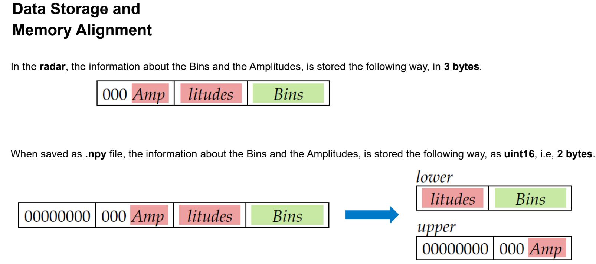
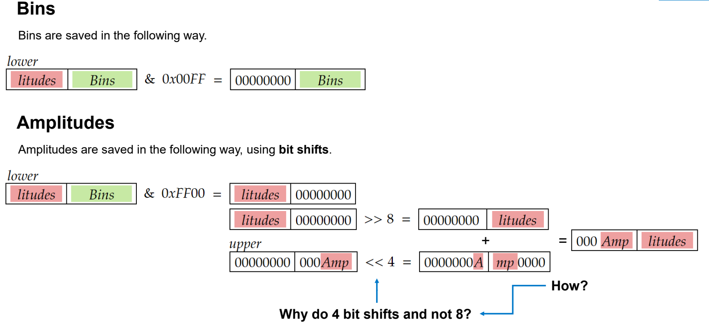

________________________________

### 3.1 Train data description

Some folders in the data didn’t contain the raw data. Since those folders can not be preprocessed, they were deleted. As a result, 29 folders are left for further consideration. The data is divided into kick and no-kick videos. During the analysis of the data, different types of kicks and no-kicks were observed.
We allocate some folders, containing target datas and labels, to train our model. A sliding window effect with stride = 1 is performed to take into account 50 frames data during the prediction instead of 1. When data is loaded, it is broken into 50x8 (8 - the number of features for each frame, as described above) windows, and each of those windows is labeled either 0 or 1, (1 if the whole kick is inside the window, 0 otherwise. Based on the initial labels of the raw data). Thus, we get new labels as ground truth for our model, but each of those labels corresponds to a 50frame-long time interval.
The correct kick takes 0.5-2 seconds. The amplitudes grow up in parallel with raising foot. However, when the foot reaches the radar, the movement is stopped and the amplitudes decrease. Amplitudes grow up again when bringing back the foot.

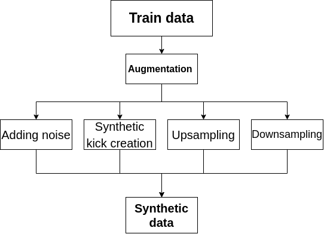

________________________________

### 3.2 Data Augmentation

All the augmentations are applied to the raw data (before the FFT transformation). The following data augmentations are used:

    1) Adding noise
    2) Synthetic Kick creation
    3) Upsampling
    4) Downsampling

    1) Adding noise to data.

      1.1) Adding Gaussian noise.
          For augmentation of more kicks and no kicks, since natural processes similar to Gaussians,
          got more kicks with this method.
          Parameters:
          The mean or expectation of the distribution (𝜇) = 1
          The variance of the distribution (𝜎) = 4
          
      1.2) Adding Uniform noise to data:
          Adding noise during training can make the training process more robust and reduce generalization error.
          Parameters:
          Low =   -25
          High =    25

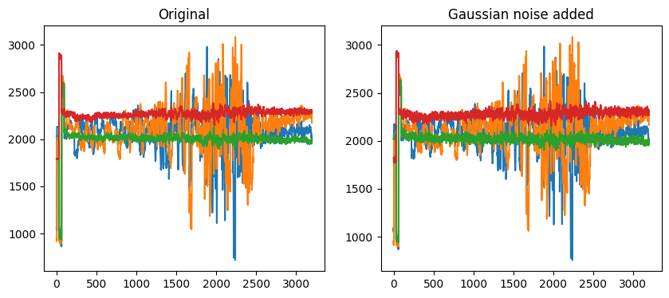

    2) Synthetic Kick creation
    
        This is done by taking existing kick segment from raw data and placing it on some background raw data.
        The placing process is checked so that there are no overlaps. Then doing convolution on merged areas to 
        smoothen range differences for getting more similar to realistic raw data.

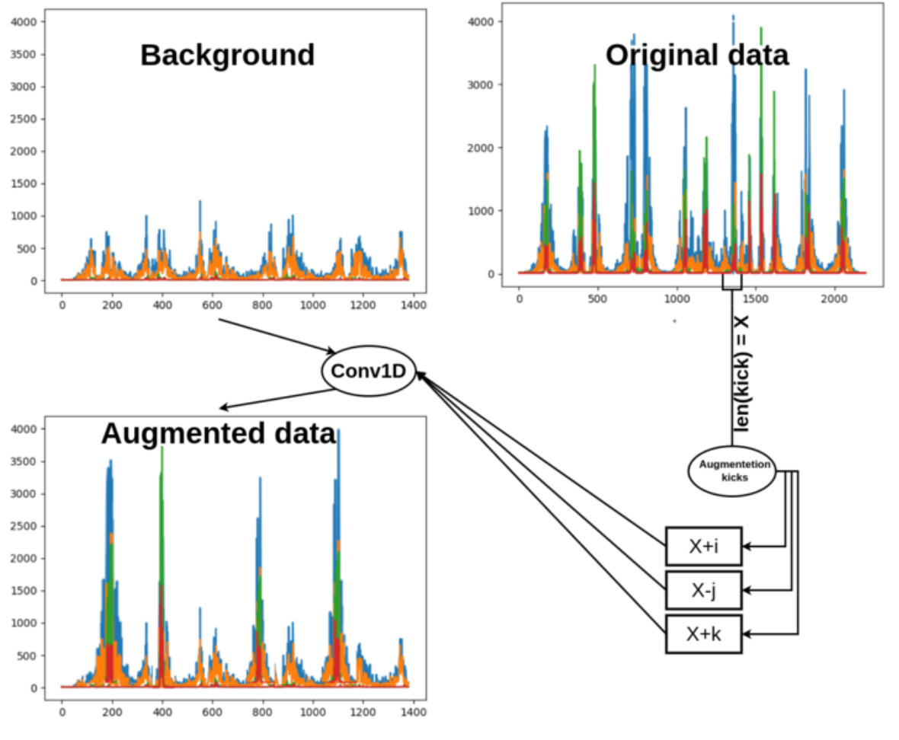>

    3) Upsampling

        The algorithm produces upsampled samples of a given count. Kicks of length 
        bigger than 12 and smaller than 35 were upsampled to random sizes in the 
        range of the original kick's length up to the maximum kick size 50. After the kick
        is upsampled, its left and right borders get randomly concatenated to complete the fixed size of 50 frames.

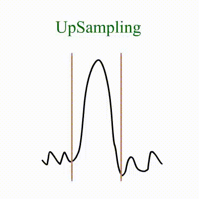

    4) Downsampling

        The algorithm produces downsampled samples of a given count.Kicks of length bigger 
        than 35 were downsampled to random sizes in the range of the minimum kick size 12 up
        to the original kick's length. After the kick is downsampled, its left and right
        borders get randomly concatenated to complete the fixed size of 50 frames.

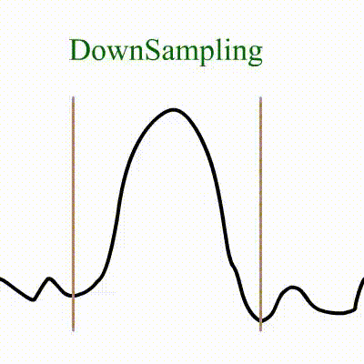

________________________________
________________________________

## Software used with Radar
    1) ML Configurator
        Allows to translate tflite, h5 format models into C code, 
        validate the model on the device or the simulator.

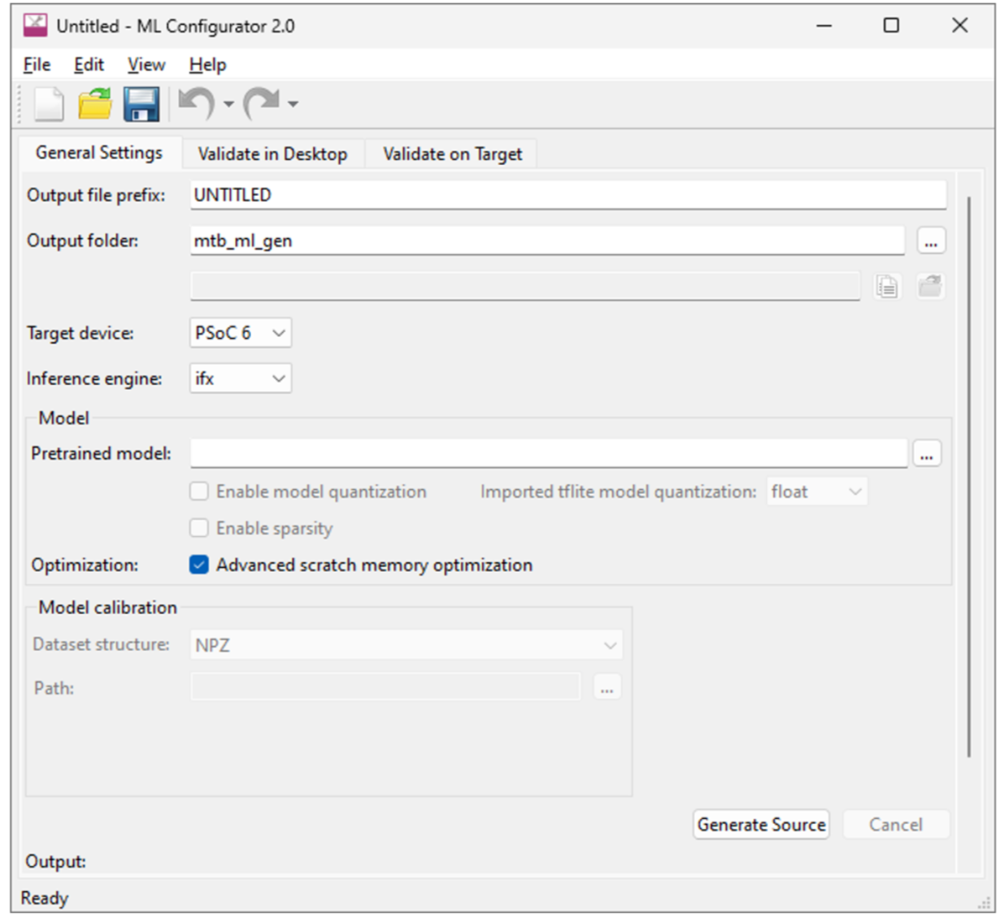

    2) Atmel Microchip Studio 7
        It gives an opportunity to build the C code and load it on the given device.
        Also, it allows loading application on a simulator, but the simulator for 
        our device is not available.

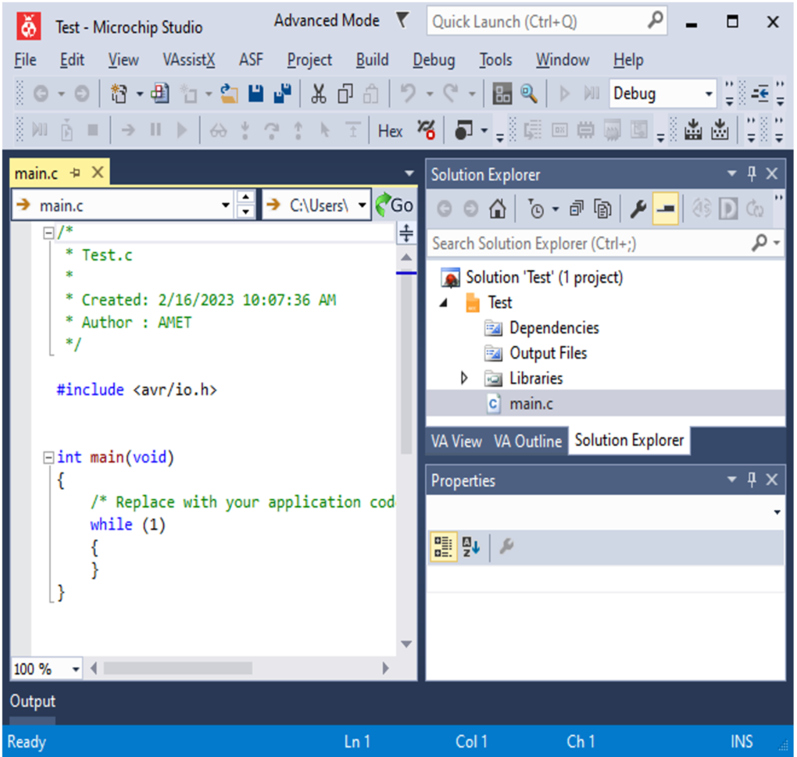

    3) MPLAB
        It allows to simulate a given hardware, run the built code on it, 
        as well as simulate the input and output (I/O) pins.

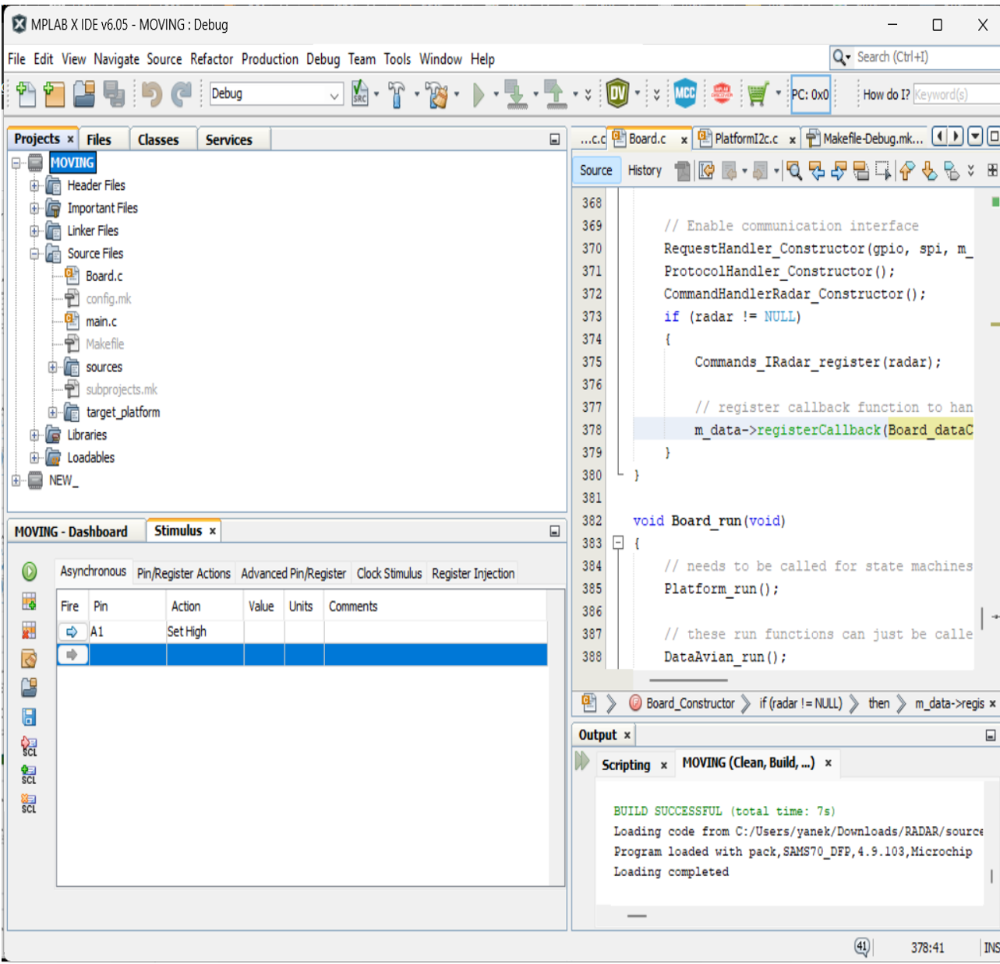

## 4. Model

The model used is a GRU (Gated Recurrent Unit) model. To solve the vanishing gradient problem of a standard RNN, GRU uses, so-called, update gate and reset gate. Basically, these are two vectors which decide what information should be passed to the output. The special thing about them is that they can be trained to keep information from long ago, without washing it through time or remove information which is irrelevant to the prediction.
The update gate helps the model to determine how much of the past information (from previous time steps) needs to be passed along to the future.

The Reset gate is used from the model to decide how much of the past information to forget.

    Our model includes:
        The input layer (shaped (50x8)).
        The GRU layer with 64 units inside.
        The Dense layer to produce 2 logits for output.

The Softmax layer.
In our case, a (50x8) sized window is given to the GRU network as an input. The label, corresponding to the (50x8) window is either 1 or 0, which was determined using the labeling technique described in the pervious section. This means, that every prediction is made taking into consideration the data from 50 time points (frames).
The model was trained for 25 epochs on the Training set. The optimizer used is Adam, and the loss is Sparce Categorical Crossentropy for classification.

## 5. Benchmarking

In order to do benchmarking and to generate an automatic pdf report you have to:

    1) Add the benchmarking data to Data folder
    2) cd to 'benchmarking'
    3) Run the command written below:
        pytest --scope all --app python
    4) After you executed the tests, a PDF report is generated in:
       ("benchmarking/artifacts/report_<branch>_<revision>.pdf")

### Examples of pdf Report:

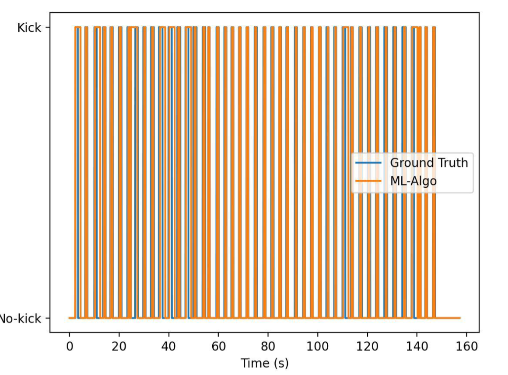
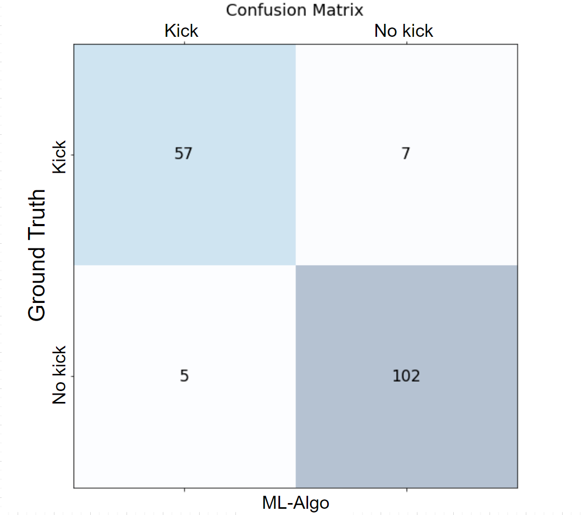

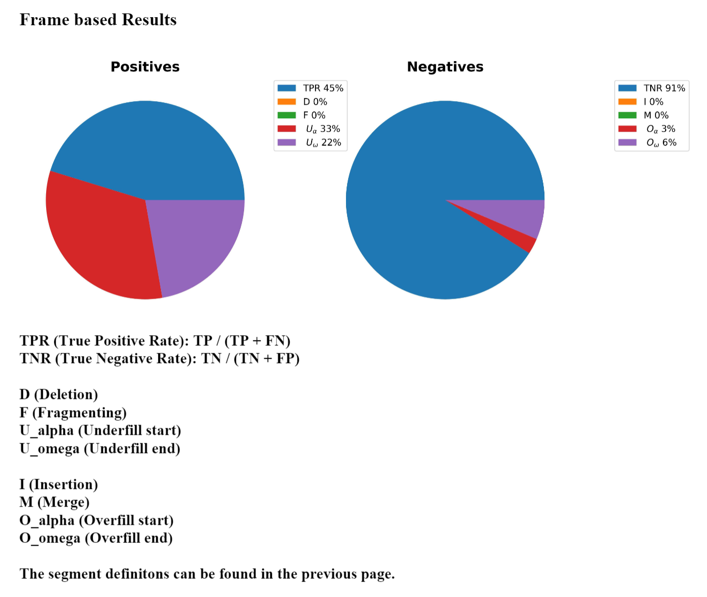
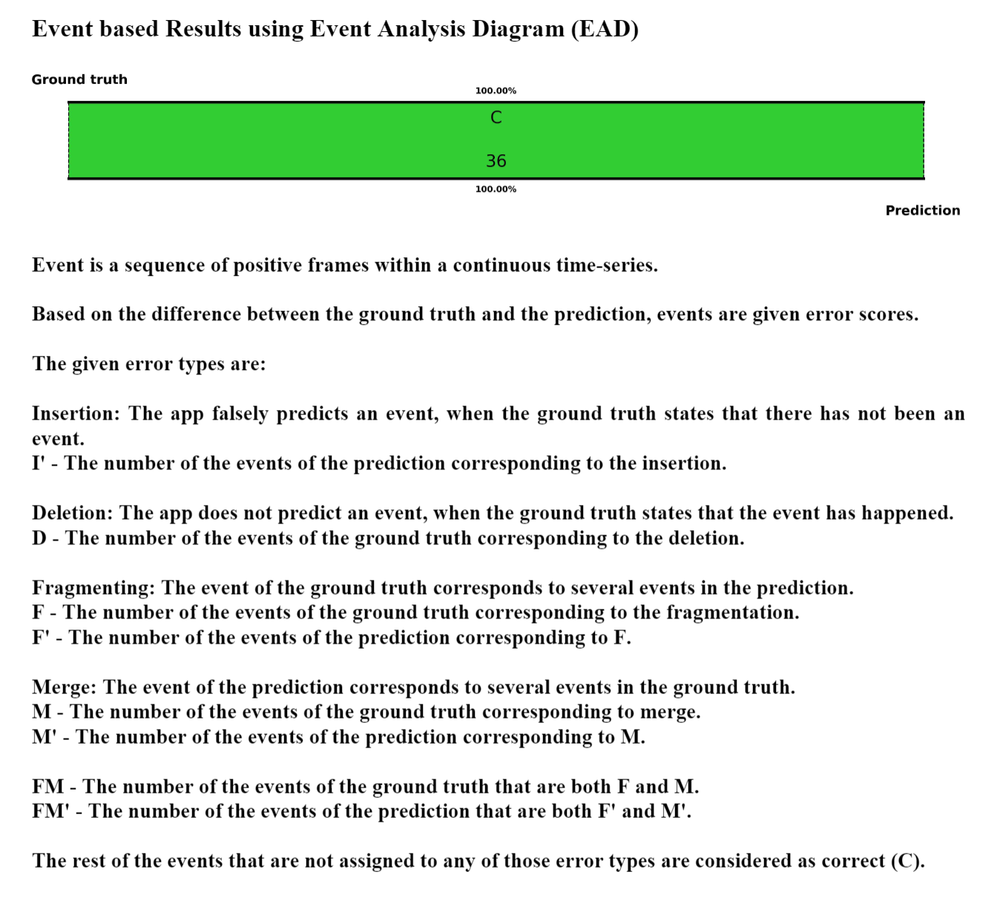

